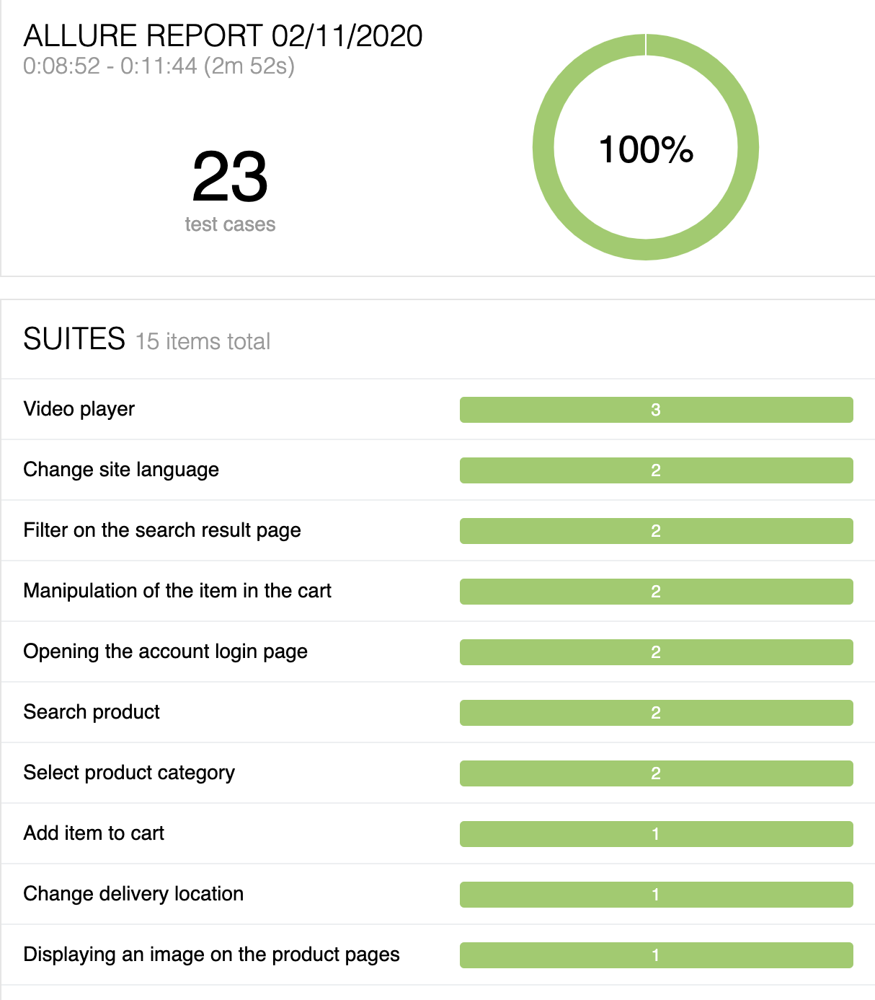

## 
## Test automation project 
Web test automation project using IntelliJ IDEA Community, Java, 
Maven, JUnit, Selenium WebDriver, Page Object Model (POM), Log4j, Allure.

## 
## Test Subject 
I've picked www.amazon.com as a test subject for no particular reason. 
It's a large site and has variety of features that we can play around with.

##
## Main classes/packages:
 * [СucumberRunnerTest.java](src/test/java/runner/CucumberRunnerTest.java) - class that runs tests;
 * [pages](src/main/java/pages) - package that stores classes with page descriptions;
 * [services](src/main/java/services) - package containing classes that store methods for interacting with page elements;
 * [stepdefs](src/test/java/stepdefs) - package containing classes with a description of test steps;
 * [features](src/test/resources/features) - package containing test scripts.
 * [helper](src/main/java/helper) -  package that contains helper classes (e.g. Logger, Locators).
 * [locators.properties](src/test/resources/locators.properties) -  file containing locators.
 
##
## Tools
 * Selenium Webdriver
 * Selenide
 * Cucumber-JVM
 * Maven
 * JUnit
 * Log4j
 * Allure

##
## Quick intro for developers
**Requirements**
* Java JDK 8

**Advised working environment**
* Eclipse / IntelliJ
* Maven

**Building with Maven** 
The project can be built by executing the following command from project root folder:
 mvn clean test

**Reporting** 
The report can be built by executing the following command from project root folder:
 mvn allure:serve

##
## Screenshots:

